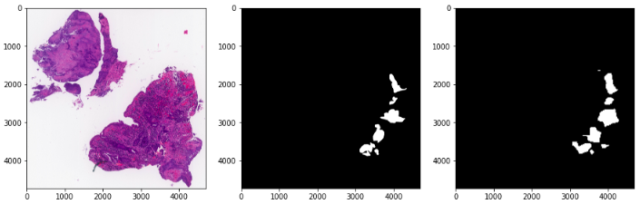

## Search for cancer cells on histological preparations using AI

Based on the presented labeled dataset of histological images of malignant neoplasms of the colon, rectosigmoid and rectum, it is necessary to develop the most accurate algorithm for identifying cancer cells in a histological sample.

[codenrock.com](https://codenrock.com/contests/hackhealth#/tasks)

Сompleted tasks:
* preprocessing(load images, data augmentation)
* training pre-trained UNET model(framework PyTorch)

Result example:

[*participant certificate*](Saltykova-1.png)
